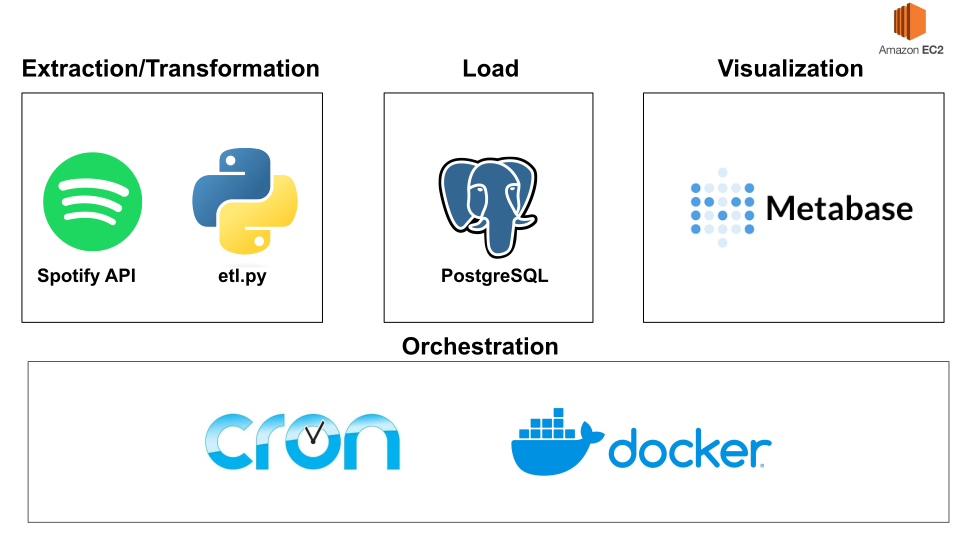
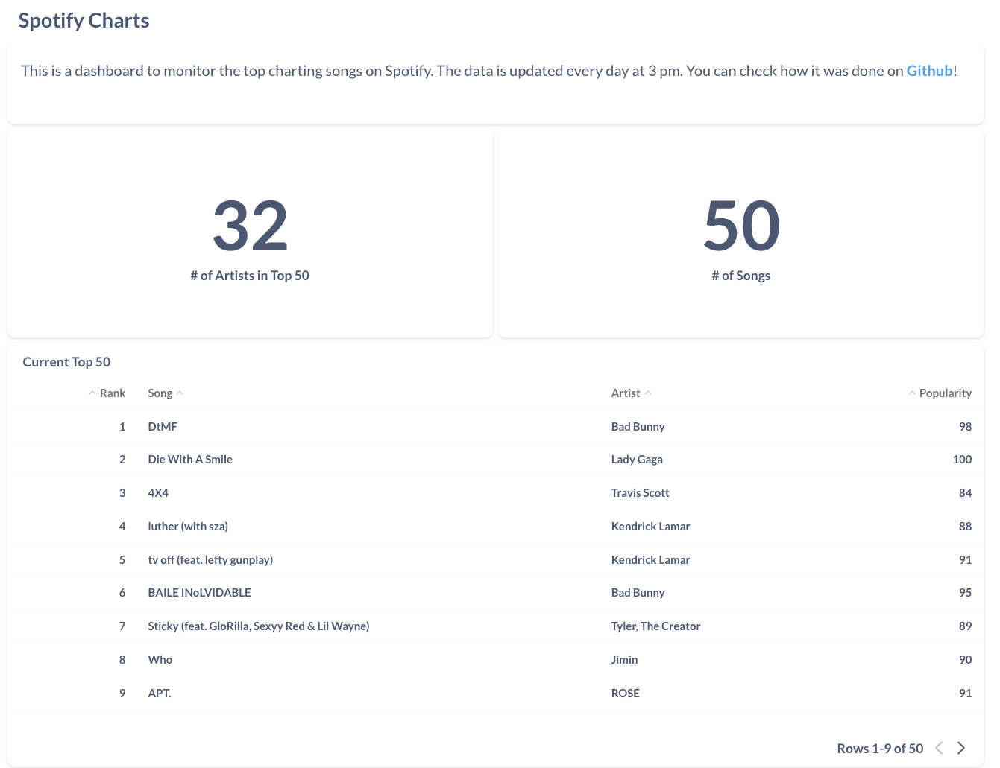
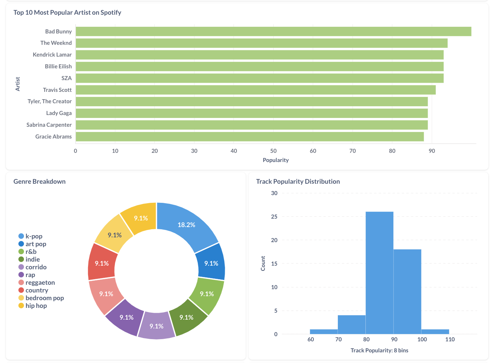
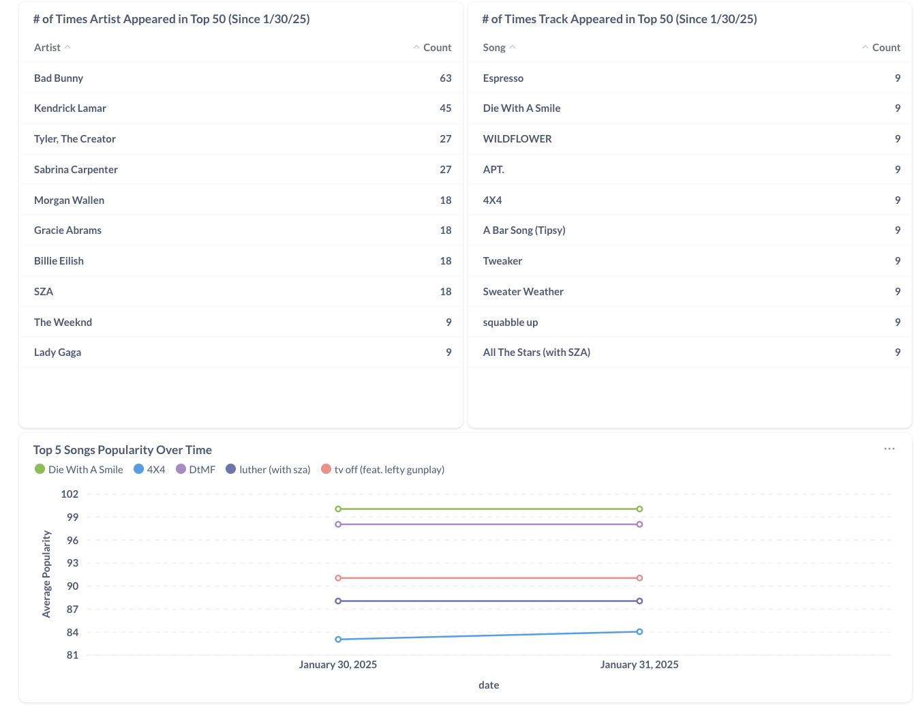

# Spotify Charts Pipeline

Data pipeline that extracts the top songs from the Spotify API using Python, PostgresSQL, cron, Metabase, and Docker.

## Objective

The official Spotify Charts doesn't give you much information besides the ranking of certain songs. This project aims to give more insightful information about music trends through an interactive dashboard and by keeping track of the charts for longer periods of time. The pipeline calls the Spotify API every day at 3 pm (when Spotify updates their metrics) to extract the Spotify charts, load the data into a database, and apply transformations for visualizations in a dashboard. The project is hosted on AWS and the dashboard can be viewed [here](http://54.197.74.226:3000/public/dashboard/65928e71-3423-43f9-8445-0bacef1a393a).

## Tools & Technologies

- API - [**Spotify API**](https://developer.spotify.com/documentation/web-api)
- Containerization - [**Docker**](https://www.docker.com), [**Docker Compose**](https://docs.docker.com/compose/)
- Database - [**PostgreSQL**](https://www.postgresql.org/)
- Data Visualization - [**Metabase**](https://www.metabase.com/)
- Language - [**Python**](https://www.python.org)

## Architecture

#### Pipeline

1. In `etl.py`, the data is pulled from the Spotify API, transformed, and inserted into a PostgreSQL database. 
2. The database connection setup is in `db.py`.
3. The data is separated into tables: `fact_rank`, `track_artist`, `artist`, and `artist_genres`. The schemas can be found at `1-create-schema.sql`.
4. The pipeline results are tested in `test_etl_integration.py` using pytest.
5. The dashboard is setup in Metabase. The queries for the visualizations can be found at `dashboard_queries.sql`.
6. The above steps are containarized by Docker and deployed to an AWS EC2 instance.

## Dashboard

See the live dashboard [here](http://54.197.74.226:3000/public/dashboard/65928e71-3423-43f9-8445-0bacef1a393a)




## Setup

1. [Docker](https://docs.docker.com/engine/install/) and [Docker Compose](https://docs.docker.com/compose/install/) v1.27.0 or later.
2. [git](https://git-scm.com/book/en/v2/Getting-Started-Installing-Git).

### Local

First create a `.env` file using `template.env`. This will allow you to setup the database.

In the working directory run:

```
docker-compose up --build
```

Then, a dashboard then can be created with the ETL data at http://localhost:3000. Connect using the `.env` file variables you created or use the default values.


## Teardown

Stop your containers with:

```
docker-compose down
```

## Future Work

- [ ] Add healthchecks
- [ ] Create unit tests
- [ ] Secure EC2 instance and 

